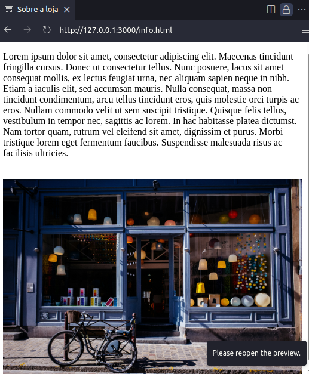
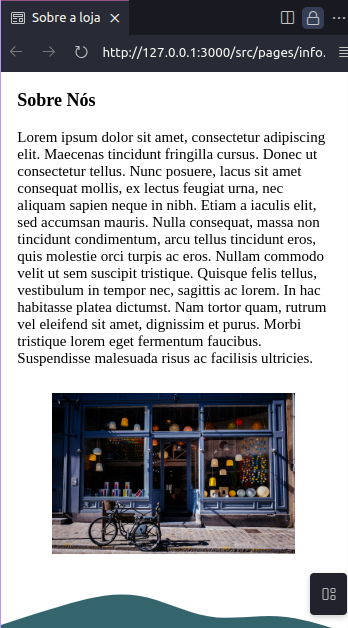
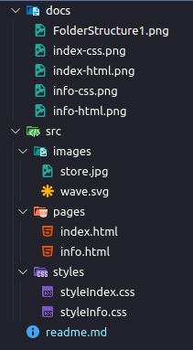
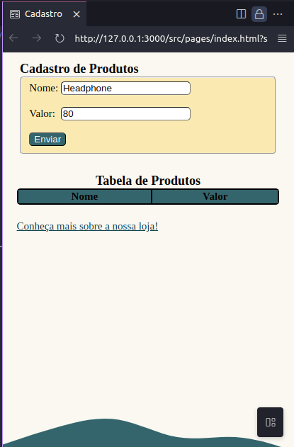
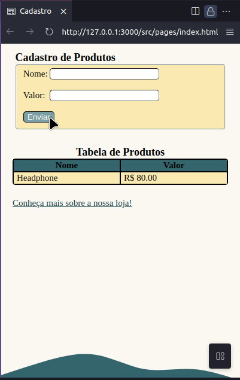
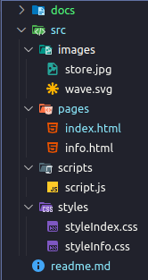

# FrontCode Challenge

This project is an exercise suggested by the course 'FrontCode' by @iuricode after each part of the book 'Guia para aprender frontend'.

## Part 1: HTML

Here, everything was made using pure HTML.

### Index page

### Info page

### Project Files Structure

---

## Part 2: CSS

Here, I've styled the HTML pages using CSS

### Index page

### Info page

### Main Color Pallete

The colors used in this project are:

- #faf8f1
- #faeab1
- #7a9ea3
- #34656d
- #114047
- #000000

### Project Files Structure

---

## Part 3: JAVASCRIPT

Here, I've added some functionalities using JavaScript

### Index page

### Info page

The info page has no interactions, so it's still the same (No JS included).

### Project Files Structure

---
