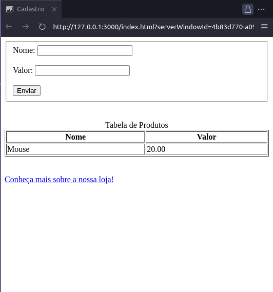
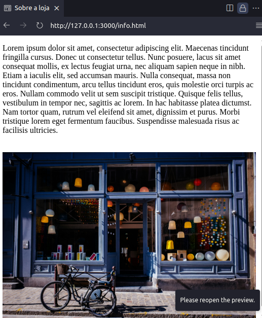
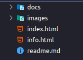

# FrontCode Challenge
This project is an exercise suggested by the course 'FrontCode' by @iuricode after each part of the book 'Guia para aprender frontend'.

## Part 1: HTML
Here, everything was made using pure HTML.

### index.html

### info.html

### Project Structure

 ---