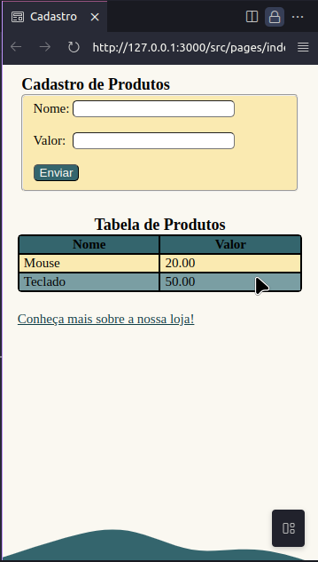
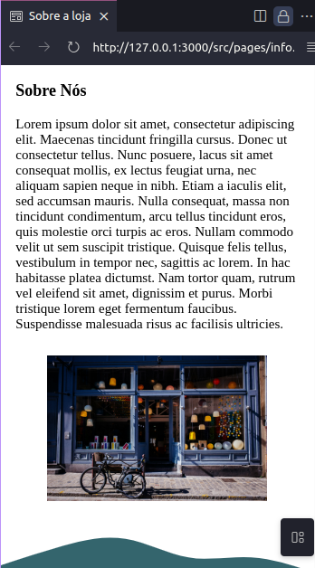
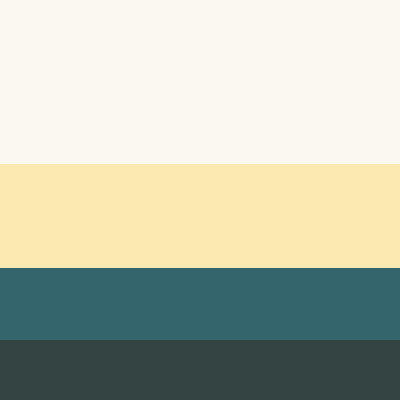
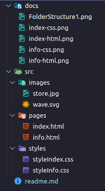

# FrontCode Challenge

This project is an exercise suggested by the course 'FrontCode' by @iuricode after each part of the book 'Guia para aprender frontend'.

## Part 1: HTML

Here, everything was made using pure HTML.

### index.html

### info.html

### Project Files Structure

---

## Part 2: CSS

Here, I've styled the HTML pages using CSS

### index.css

### info.css

### Main Color Pallete

The colors used in this project are:

- #faf8f1
- #faeab1
- #34656d
- #7a9ea3
- #114047
- #000000

### Project Files Structure

---
